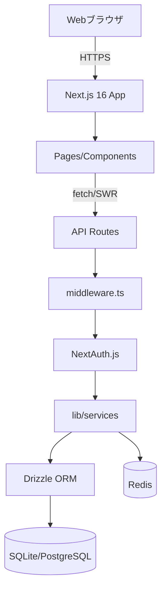
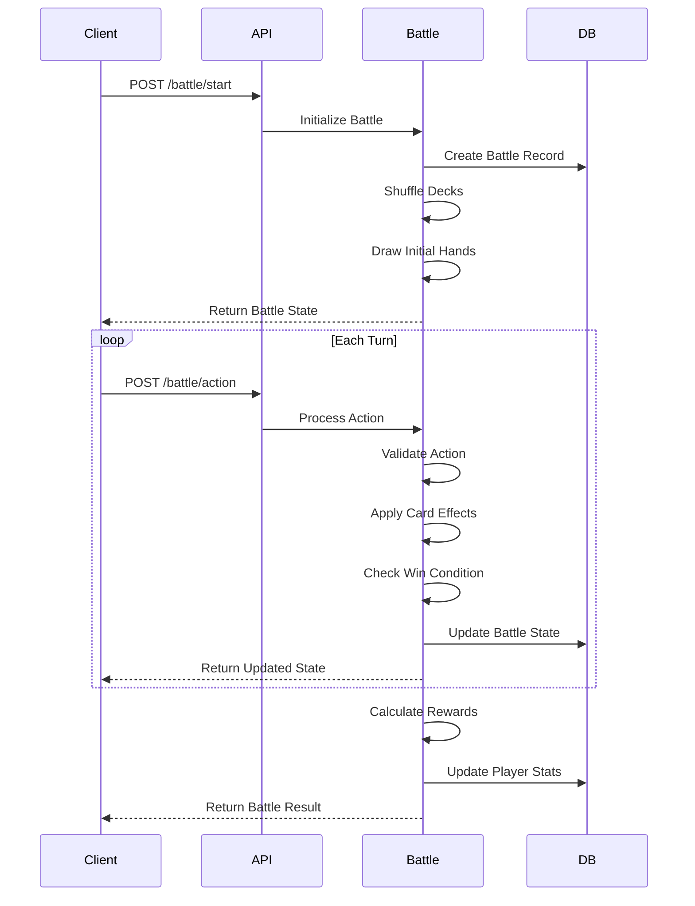

# 設計書

## 概要

本設計書は、PC向けソーシャルカードゲームのアーキテクチャと実装詳細を定義します。システムはNext.js 16フルスタックアプリケーションとして実装され、App RouterとAPI Routesを活用します。

**現在の実装状況（2024年12月時点）:**

**バックエンド（完了度: 85%）:**
- ✅ プロジェクト基盤（Next.js 16 + Turbopack）
- ✅ データベーススキーマ（Drizzle ORM + SQLite、30種類以上のカードマスターデータ）
- ✅ 認証システム（NextAuth.js v5、Credentials Provider、開発用ログイン）
- ✅ プレイヤーサービス（プロフィール、経験値、通貨、スタミナ、デイリーログイン）
- ✅ カードサービス（マスターデータ、コレクション、強化システム）
- ✅ デッキサービス（CRUD、バリデーション、コスト計算）
- ✅ ガチャサービス（確率抽選、10連保証、履歴記録）
- ✅ クエストサービス（開始、完了、報酬配布、進行状況追跡）
- ✅ フレンドサービス（申請、承認、削除、検索、双方向フレンドシップ）
- ✅ ランキングサービス（レベル、パワー、勝利数、勝率別ランキング）
- ✅ 全APIエンドポイント（30以上）
- ⏳ バトルシステム（未実装）

**フロントエンド（完了度: 20%）:**
- ✅ ページ構造（認証、ゲーム画面のルーティング）
- ✅ 基本レイアウトコンポーネント
- ⏳ UIコンポーネントの実装（shadcn/ui統合済み、個別画面は未実装）
- ⏳ 状態管理（Zustand、SWR設定済み、実装は未完了）
- ⏳ アニメーション（Framer Motion設定済み、実装は未完了）

**テスト（完了度: 15%）:**
- ✅ E2Eテスト環境（Playwright設定済み）
- ✅ 基本的なE2Eテスト（dev-login、gacha、player-content）
- ⏳ 包括的なテストカバレッジ（未完了）

## アーキテクチャ

### システム構成



### 技術スタック

**フルスタック:**
- フレームワーク: Next.js 16.0.0 (App Router + Turbopack)
- 言語: TypeScript 5.7.2
- UIライブラリ: React 19.0.0
- スタイリング: Tailwind CSS 3.4.15 + shadcn/ui
- ORM: Drizzle ORM 0.36.4
- データベース: SQLite (開発) / PostgreSQL (本番想定) + Redis 4.7.0 (キャッシュ)
- 認証: NextAuth.js v5.0.0-beta.25 (Auth.js)
- 状態管理: Zustand 5.0.2 + SWR 2.2.5 (データフェッチング)
- アニメーション: Framer Motion 11.15.0
- ドラッグ&ドロップ: @dnd-kit/core 6.3.1
- フォーム: React Hook Form 7.54.2 + Zod 3.24.1
- 通知: Sonner 1.7.4
- テスト: Playwright 1.56.1

## コンポーネントとインターフェース

### 1. 認証サービス (Auth Service)

**責務:**
- ユーザー登録とログイン
- JWTトークンの発行と検証
- セッション管理

**API エンドポイント:**

```typescript
POST /api/auth/register
Request: {
  username: string;
  email: string;
  password: string;
}
Response: {
  userId: string;
  token: string;
  refreshToken: string;
}

POST /api/auth/login
Request: {
  email: string;
  password: string;
}
Response: {
  userId: string;
  token: string;
  refreshToken: string;
}

POST /api/auth/refresh
Request: {
  refreshToken: string;
}
Response: {
  token: string;
}
```

### 2. プレイヤーサービス (Player Service)

**責務:**
- プレイヤープロフィール管理
- レベルと経験値の計算
- 通貨管理
- スタミナ管理

**API エンドポイント:**

```typescript
GET /api/player/profile
Response: {
  playerId: string;
  username: string;
  level: number;
  exp: number;
  gold: number;
  gems: number;
  stamina: number;
  maxStamina: number;
  lastStaminaUpdate: timestamp;
  iconUrl: string;
}

PUT /api/player/profile
Request: {
  username?: string;
  iconUrl?: string;
}
Response: PlayerProfile

POST /api/player/stamina/recover
Request: {
  amount: number;
  useItem?: boolean;
  useGems?: boolean;
}
Response: {
  stamina: number;
  maxStamina: number;
}

GET /api/player/daily-login
Response: {
  consecutiveDays: number;
  rewards: Reward[];
  claimed: boolean;
}

POST /api/player/daily-login/claim
Response: {
  rewards: Reward[];
  newConsecutiveDays: number;
}
```

### 3. カードサービス (Card Service)

**責務:**
- カードマスターデータ管理
- プレイヤーのカードコレクション管理
- カード強化とレベルアップ
- デッキ管理

**API エンドポイント:**

```typescript
GET /api/cards/master
Response: {
  cards: CardMaster[];
}

GET /api/cards/collection
Response: {
  cards: PlayerCard[];
}

POST /api/cards/enhance
Request: {
  targetCardId: string;
  materialCardIds: string[];
  gold: number;
}
Response: {
  enhancedCard: PlayerCard;
  remainingGold: number;
}

GET /api/decks
Response: {
  decks: Deck[];
}

POST /api/decks
Request: {
  name: string;
  cardIds: string[];
}
Response: Deck

PUT /api/decks/:deckId
Request: {
  name?: string;
  cardIds?: string[];
}
Response: Deck

DELETE /api/decks/:deckId
Response: { success: boolean }
```

### 4. ガチャサービス (Gacha Service)

**責務:**
- ガチャ実行とカード抽選
- 確率計算と保証システム
- ガチャ履歴管理

**API エンドポイント:**

```typescript
GET /api/gacha/banners
Response: {
  banners: GachaBanner[];
}

POST /api/gacha/pull
Request: {
  bannerId: string;
  pullType: 'single' | 'multi';
  currency: 'gold' | 'gems';
}
Response: {
  cards: PlayerCard[];
  remainingCurrency: number;
  guaranteeProgress: number;
}

GET /api/gacha/history
Response: {
  history: GachaHistory[];
}
```

### 5. バトルサービス (Battle Service)

**責務:**
- バトルロジックの実行
- ターン管理
- 勝敗判定と報酬計算

**API エンドポイント:**

```typescript
POST /api/battle/start
Request: {
  deckId: string;
  battleType: 'quest' | 'pvp' | 'friend';
  targetId?: string; // questId or opponentId
}
Response: {
  battleId: string;
  initialState: BattleState;
}

POST /api/battle/:battleId/action
Request: {
  action: 'play_card' | 'attack' | 'end_turn';
  cardId?: string;
  targetId?: string;
}
Response: {
  battleState: BattleState;
  isFinished: boolean;
  result?: BattleResult;
}

GET /api/battle/:battleId/state
Response: {
  battleState: BattleState;
}
```

### 6. クエストサービス (Quest Service)

**責務:**
- クエストデータ管理
- クエスト進行状況追跡
- 報酬配布

**API エンドポイント:**

```typescript
GET /api/quests
Response: {
  quests: Quest[];
}

GET /api/quests/:questId
Response: Quest

POST /api/quests/:questId/start
Response: {
  battleId: string;
  staminaCost: number;
  remainingStamina: number;
}

POST /api/quests/:questId/complete
Request: {
  battleId: string;
  victory: boolean;
}
Response: {
  rewards: Reward[];
  firstClearBonus?: Reward[];
}
```

### 7. ソーシャルサービス (Social Service)

**責務:**
- フレンド管理
- フレンド申請とメッセージ
- ランキング管理

**API エンドポイント:**

```typescript
GET /api/social/friends
Response: {
  friends: Friend[];
}

POST /api/social/friends/request
Request: {
  targetPlayerId: string;
}
Response: {
  requestId: string;
}

POST /api/social/friends/accept
Request: {
  requestId: string;
}
Response: {
  friend: Friend;
}

DELETE /api/social/friends/:friendId
Response: { success: boolean }

GET /api/social/ranking
Query: {
  type: 'pvp' | 'level';
  limit?: number;
}
Response: {
  rankings: RankingEntry[];
  playerRank: number;
}

POST /api/social/support/use
Request: {
  friendId: string;
  supportCardId: string;
}
Response: {
  friendshipPoints: number;
}
```

## データモデル

### Player (プレイヤー)

```typescript
interface Player {
  id: string;
  username: string;
  email: string;
  passwordHash: string;
  level: number;
  exp: number;
  gold: number;
  gems: number;
  stamina: number;
  maxStamina: number;
  lastStaminaUpdate: Date;
  iconUrl: string;
  consecutiveLoginDays: number;
  lastLoginDate: Date;
  createdAt: Date;
  updatedAt: Date;
}
```

### CardMaster (カードマスターデータ)

```typescript
interface CardMaster {
  id: string;
  name: string;
  rarity: 'common' | 'rare' | 'super_rare' | 'ultra_rare';
  attribute: 'fire' | 'water' | 'earth' | 'wind' | 'light' | 'dark';
  cost: number;
  baseAttack: number;
  baseDefense: number;
  maxLevel: number;
  skillId?: string;
  imageUrl: string;
  description: string;
}
```

### PlayerCard (プレイヤー所有カード)

```typescript
interface PlayerCard {
  id: string;
  playerId: string;
  cardMasterId: string;
  level: number;
  exp: number;
  attack: number; // baseAttack + level bonus
  defense: number; // baseDefense + level bonus
  acquiredAt: Date;
}
```

### Deck (デッキ)

```typescript
interface Deck {
  id: string;
  playerId: string;
  name: string;
  cardIds: string[]; // 20-40 cards
  totalCost: number;
  isActive: boolean;
  createdAt: Date;
  updatedAt: Date;
}
```

### Battle (バトル)

```typescript
interface Battle {
  id: string;
  battleType: 'quest' | 'pvp' | 'friend';
  player1Id: string;
  player2Id: string; // AI for quests
  player1DeckId: string;
  player2DeckId: string;
  currentTurn: number;
  currentPlayerId: string;
  player1Life: number;
  player2Life: number;
  player1Field: FieldCard[];
  player2Field: FieldCard[];
  player1Hand: string[];
  player2Hand: string[];
  player1Deck: string[];
  player2Deck: string[];
  winnerId?: string;
  rewards?: Reward[];
  startedAt: Date;
  finishedAt?: Date;
}

interface FieldCard {
  cardId: string;
  position: number;
  canAttack: boolean;
}
```

### Quest (クエスト)

```typescript
interface Quest {
  id: string;
  name: string;
  description: string;
  difficulty: 'easy' | 'normal' | 'hard' | 'expert';
  staminaCost: number;
  requiredLevel: number;
  enemyDeckId: string;
  rewards: Reward[];
  firstClearRewards: Reward[];
  isAvailable: boolean;
}

interface QuestProgress {
  playerId: string;
  questId: string;
  cleared: boolean;
  clearedAt?: Date;
  attempts: number;
}
```

### Friend (フレンド)

```typescript
interface Friend {
  id: string;
  playerId: string;
  friendId: string;
  friendshipPoints: number;
  lastInteraction: Date;
  createdAt: Date;
}

interface FriendRequest {
  id: string;
  senderId: string;
  receiverId: string;
  status: 'pending' | 'accepted' | 'rejected';
  createdAt: Date;
  respondedAt?: Date;
}
```

### Gacha (ガチャ)

```typescript
interface GachaBanner {
  id: string;
  name: string;
  description: string;
  startDate: Date;
  endDate: Date;
  costGold?: number;
  costGems?: number;
  featuredCardIds: string[];
  rateUpCardIds: string[];
  guaranteeThreshold: number; // 10連で1枚SR以上保証
}

interface GachaHistory {
  id: string;
  playerId: string;
  bannerId: string;
  pullType: 'single' | 'multi';
  cardsObtained: string[];
  currencyUsed: 'gold' | 'gems';
  amount: number;
  pulledAt: Date;
}
```

### Ranking (ランキング)

```typescript
interface Ranking {
  playerId: string;
  rankingType: 'pvp' | 'level';
  score: number;
  rank: number;
  season: string;
  updatedAt: Date;
}
```

## バトルシステムの詳細設計

### バトルフロー



### ターン処理

1. **ターン開始フェーズ:**
   - カードを1枚ドロー
   - コストを回復（最大10、毎ターン+1）
   - 場のカードの「攻撃可能」フラグをtrueに設定

2. **メインフェーズ:**
   - プレイヤーはコスト範囲内でカードをプレイ
   - カードの効果を発動
   - 場のカードで攻撃を実行

3. **ターン終了フェーズ:**
   - ターンを相手に渡す
   - エンドフェーズ効果を処理

### 勝敗判定

- いずれかのプレイヤーのライフが0以下になった時点で終了
- デッキが尽きた場合、そのプレイヤーは毎ターン1ダメージ
- 50ターン経過で引き分け（両者敗北扱い）

### ダメージ計算

```
実ダメージ = 攻撃側カードの攻撃力 - 防御側カードの防御力
実ダメージ = max(実ダメージ, 1) // 最低1ダメージ
```

## ガチャシステムの詳細設計

### 確率テーブル

```typescript
const BASE_RATES = {
  common: 0.70,      // 70%
  rare: 0.20,        // 20%
  super_rare: 0.08,  // 8%
  ultra_rare: 0.02   // 2%
};
```

### 10連ガチャ保証ロジック

```typescript
function performMultiPull(bannerId: string): PlayerCard[] {
  const results: PlayerCard[] = [];
  let hasRareOrAbove = false;
  
  // 最初の9枚を通常抽選
  for (let i = 0; i < 9; i++) {
    const card = drawCard(bannerId);
    results.push(card);
    if (card.rarity !== 'common') {
      hasRareOrAbove = true;
    }
  }
  
  // 10枚目: Rare以上が出ていなければ保証
  if (!hasRareOrAbove) {
    const guaranteedCard = drawGuaranteedRareOrAbove(bannerId);
    results.push(guaranteedCard);
  } else {
    const card = drawCard(bannerId);
    results.push(card);
  }
  
  return results;
}
```

## スタミナ回復システム

### 自動回復ロジック

```typescript
function calculateCurrentStamina(player: Player): number {
  const now = Date.now();
  const lastUpdate = player.lastStaminaUpdate.getTime();
  const minutesPassed = Math.floor((now - lastUpdate) / (1000 * 60));
  
  // 5分で1スタミナ回復
  const recoveredStamina = Math.floor(minutesPassed / 5);
  const currentStamina = Math.min(
    player.stamina + recoveredStamina,
    player.maxStamina
  );
  
  return currentStamina;
}
```

## エラーハンドリング

### エラーコード体系

```typescript
enum ErrorCode {
  // 認証エラー (1000番台)
  INVALID_TOKEN = 1001,
  EXPIRED_TOKEN = 1002,
  UNAUTHORIZED = 1003,
  
  // プレイヤーエラー (2000番台)
  PLAYER_NOT_FOUND = 2001,
  INSUFFICIENT_GOLD = 2002,
  INSUFFICIENT_GEMS = 2003,
  INSUFFICIENT_STAMINA = 2004,
  LEVEL_TOO_LOW = 2005,
  
  // カードエラー (3000番台)
  CARD_NOT_FOUND = 3001,
  CARD_NOT_OWNED = 3002,
  INVALID_DECK_SIZE = 3003,
  DECK_COST_EXCEEDED = 3004,
  DUPLICATE_CARD_LIMIT = 3005,
  
  // バトルエラー (4000番台)
  BATTLE_NOT_FOUND = 4001,
  INVALID_BATTLE_ACTION = 4002,
  NOT_PLAYER_TURN = 4003,
  BATTLE_ALREADY_FINISHED = 4004,
  
  // ガチャエラー (5000番台)
  BANNER_NOT_AVAILABLE = 5001,
  INSUFFICIENT_CURRENCY = 5002,
  
  // ソーシャルエラー (6000番台)
  FRIEND_LIMIT_REACHED = 6001,
  ALREADY_FRIENDS = 6002,
  FRIEND_REQUEST_NOT_FOUND = 6003,
  
  // システムエラー (9000番台)
  INTERNAL_SERVER_ERROR = 9001,
  DATABASE_ERROR = 9002,
  VALIDATION_ERROR = 9003
}

interface ErrorResponse {
  code: ErrorCode;
  message: string;
  details?: any;
}
```

### エラーハンドリング戦略

- すべてのAPIエンドポイントは統一されたエラーレスポンス形式を返す
- クライアント側でエラーコードに基づいて適切なメッセージを表示
- 重大なエラーはログシステムに記録し、監視アラートを発火
- データベーストランザクションはロールバック可能に設計

## テスト戦略

### ユニットテスト

**対象:**
- ビジネスロジック関数
- データモデルのバリデーション
- ユーティリティ関数

**ツール:**
- Jest (Node.js/TypeScript)
- pytest (Python)

**カバレッジ目標:** 80%以上

### 統合テスト

**対象:**
- APIエンドポイント
- データベース操作
- サービス間連携

**ツール:**
- Supertest (API testing)
- Testcontainers (DB testing)

### E2Eテスト

**対象:**
- 主要なユーザーフロー
  - 新規登録からチュートリアル完了
  - ガチャ実行とデッキ編成
  - クエストバトル完了
  - フレンド追加と協力プレイ

**ツール:**
- Playwright
- Cypress

### パフォーマンステスト

**対象:**
- 同時接続数の負荷テスト
- データベースクエリのパフォーマンス
- APIレスポンスタイム

**ツール:**
- Apache JMeter
- k6

**目標:**
- APIレスポンスタイム: 95パーセンタイルで200ms以下
- 同時接続: 10,000ユーザー対応
- データベースクエリ: 50ms以下

## セキュリティ考慮事項

### 実際のプロジェクト構造

```
social-card-game/
├── app/                       # Next.js App Router
│   ├── (auth)/               # 認証グループ（実装済み）
│   │   ├── login/
│   │   └── register/
│   ├── (game)/               # ゲームグループ（構造のみ）
│   ├── api/                  # API Routes（基本実装済み）
│   │   ├── auth/            # 認証API
│   │   │   ├── [...nextauth]/
│   │   │   ├── dev-login/
│   │   │   └── register/
│   │   ├── player/          # プレイヤーAPI
│   │   │   ├── profile/
│   │   │   ├── stamina/
│   │   │   └── daily-login/
│   │   ├── cards/           # カードAPI
│   │   │   ├── master/
│   │   │   ├── collection/
│   │   │   └── enhance/
│   │   ├── decks/           # デッキAPI
│   │   ├── gacha/           # ガチャAPI
│   │   │   ├── banners/
│   │   │   ├── pull/
│   │   │   └── history/
│   │   ├── battle/          # バトルAPI（未実装）
│   │   ├── quests/          # クエストAPI
│   │   ├── friends/         # フレンドAPI
│   │   ├── ranking/         # ランキングAPI
│   │   └── social/          # ソーシャルAPI
│   ├── cards/               # カードページ
│   ├── decks/               # デッキページ
│   ├── gacha/               # ガチャページ
│   ├── home/                # ホームページ
│   ├── friends/             # フレンドページ
│   ├── quests/              # クエストページ
│   ├── ranking/             # ランキングページ
│   ├── layout.tsx
│   ├── page.tsx
│   └── globals.css
├── components/               # Reactコンポーネント
│   ├── ui/                  # shadcn/ui コンポーネント
│   ├── game/                # ゲーム固有コンポーネント
│   ├── layout/              # レイアウトコンポーネント
│   └── ErrorBoundary.tsx
├── lib/                      # ユーティリティ
│   ├── db/                  # Drizzle クライアント
│   ├── auth/                # NextAuth設定
│   ├── redis/               # Redis クライアント
│   ├── services/            # ビジネスロジック
│   ├── utils/               # 汎用ユーティリティ
│   ├── db.ts
│   ├── logger.ts
│   ├── api-logger.ts
│   └── client-logger.ts
├── hooks/                    # カスタムフック（空）
├── stores/                   # Zustand ストア（空）
├── types/                    # TypeScript型定義
│   ├── index.ts
│   └── next-auth.d.ts
├── drizzle/                  # Drizzle ORM
│   ├── schema.ts            # スキーマ定義（完成）
│   ├── seed.ts              # シードデータ
│   └── migrate.ts           # マイグレーション
├── public/                   # 静的ファイル
│   ├── cards/               # カード画像
│   └── assets/              # その他アセット
├── tests/                    # テスト
│   └── e2e/                 # Playwright E2Eテスト
├── auth.ts                   # NextAuth設定
├── middleware.ts             # Next.js middleware
├── drizzle.config.ts         # Drizzle設定
├── social-card-game.db       # SQLiteデータベース
└── package.json
```

### 認証・認可（実装済み）

- NextAuth.js v5.0.0-beta.25 を使用
- Credentials Provider でメール/パスワード認証
- Drizzle Adapter で認証データを管理
- セッションはJWTベース、HTTPOnly Cookieで管理
- middleware.ts で保護ルートを設定
- パスワードはbcryptjs でハッシュ化
- 開発用ログインエンドポイント（/api/auth/dev-login）あり

### Next.js 16の活用

**Async Request APIs:**
```typescript
// cookies, headers, paramsが非同期に
import { cookies } from 'next/headers';

export async function GET() {
  const cookieStore = await cookies();
  const token = cookieStore.get('token');
}
```

**after() API:**
```typescript
import { after } from 'next/server';

export async function POST(request: Request) {
  // レスポンスを返した後にログ記録
  after(async () => {
    await logAnalytics(request);
  });
  
  return Response.json({ success: true });
}
```

**cacheLife と cacheTag:**
```typescript
import { unstable_cacheLife as cacheLife } from 'next/cache';

export async function getCardMaster() {
  'use cache';
  cacheLife('hours'); // 1時間キャッシュ
  
  return await db.select().from(cardMaster);
}
```

### データ保護

- 通信は全てHTTPS/TLS 1.3以上
- 個人情報はデータベースレベルで暗号化
- SQLインジェクション対策: パラメータ化クエリの使用
- XSS対策: 入力値のサニタイゼーション

### 不正対策

- レート制限: 同一IPから1分間に60リクエストまで
- ガチャ結果の検証: サーバー側で乱数生成と検証
- バトル結果の検証: クライアントからの結果を信頼せず、サーバー側で再計算
- 通貨操作の監査ログ記録

### チート対策

- 重要な計算は全てサーバー側（API Routes）で実行
- クライアントから送信されるデータは全て検証
- 異常な行動パターンの検知システム
- 本番環境では開発者ツールの使用を検知

### Web通知システム

**ブラウザ通知:**
```typescript
// Web Notifications API
if ('Notification' in window && Notification.permission === 'granted') {
  new Notification('スタミナ満タン！', {
    body: 'クエストに挑戦しましょう',
    icon: '/icon.png'
  });
}
```

**アプリ内通知:**
- React Hot Toast または Sonner でトースト通知
- WebSocketまたはポーリングでリアルタイム更新
- 未読通知バッジ表示

## スケーラビリティ

### 水平スケーリング

- ステートレスなAPIサーバー設計
- ロードバランサーによる負荷分散
- データベースのリードレプリカ活用

### キャッシュ戦略

- カードマスターデータ: Redis に永続キャッシュ
- プレイヤープロフィール: 5分間キャッシュ
- ランキングデータ: 1分間キャッシュ
- クエストデータ: 10分間キャッシュ

### データベース最適化

- 適切なインデックス設計
- クエリの最適化とN+1問題の回避
- パーティショニング（プレイヤーデータを地域別に分割）
- 定期的なバキューム処理

## 監視とロギング

### メトリクス

- APIレスポンスタイム
- エラーレート
- アクティブユーザー数
- データベース接続数
- キャッシュヒット率

### ログ

- アプリケーションログ（INFO, WARN, ERROR）
- アクセスログ
- 監査ログ（通貨操作、ガチャ実行）
- エラーログ（スタックトレース付き）

### アラート

- エラーレートが5%を超えた場合
- APIレスポンスタイムが500msを超えた場合
- データベース接続エラー
- サーバーのCPU/メモリ使用率が80%を超えた場合
